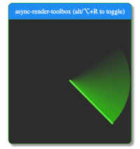

At [dashdash](https://www.dashdash.com) we build spreadsheets with super-powers, we aim to create tools that make computation accessible to everyone.

Our spreadsheet supports most of the standard excel formulas, external API integrations and some dashdash specific functions that allow you to integrate any API through GET and POST requests (learn more about dashdash in our [landing page](http://dashdash.com)). Given this flexibility most of our computation has to be done in the backend, but not all of it. For the formulas that do not require HTTP requests to be fired, we could "easily" do them in the frontend.

Currently we do all the computation on the backend, that means that even the "trivial" operations such as arithemetical operations need to go the backend, and these are operations should feel immediate to the user. Nobody got time to wait ~80ms for a **sum** result :smile:.

# Frontend Computation
One of our cells has the mission to ensure that the platform is scalable. Among all of the ideas to achieve the end goal, there is the "Frontend Computation". We would rely on the frontend to perform the calculations that do not require HTTP requests or any other form to integration with external data.

While most users have simple spreadsheets, we only limit the graph of dependencies of a cell to 100 000. A power user can easily create a spreadsheet with a insane cell dependencies graph. 

Given our large constraints, editing a cell might have a ripple effect that triggers operations in thousands of other cells either directly or by association with other cells. If we execute those operations by iterating each affected cell / formula we'll completely freeze the browser and provide a terrible user experience.

# Requirements
Our solution for the frontend computation should support the following requirements:

* No dropped frames, the page should be responsive at all times
* Processing should be interruptable (either because new data was introduced or user wants to leave the page)
* UI should be updated only when full computation is complete (we don't want stale data to be presented)
* Should be as fast as possible given the previous constraints (if we split execution in chunks it will take a bit longer to process but the page will be responsive, and therefore the perceived perfomance will appear to be better)
* Relatively easy to maintain and to reason with

# How to test our solutions
* Create a simple example;
* Use [async-render-toolbox](https://github.com/sw-yx/async-render-toolbox) chrome extensions to have a visual cue of the CPU lag;
* Create a counter and a timer to make sure page is still interactive while processing a queue;
* Use devtools for some extra performance inspection;

# Test case
A spreadsheet in which A1=99 and each row from A2 to A100000 adds 10 the previous row. A2 will be computed to 109, A3 to 119, etc. A100000 will be 99 + (10 * 99 999) = 1 000 089. As you can imagine, changing the value of A1 will have a ripple effect and 99 999 calcs would have to be done, **sequentially**. 

We need to define a datastructure and a traversal algorithm to test our solutions. Since the problem we're tackling is only related with high CPU usage, we can easily create this scenario without a complex algorithm or data strucuture. Lets not think about possible circular dependencies, cells with multiple dependencies, ranges to select cells and other challenges that we already face on the backend computation.

Given a object with each cell indexed by id, we're going to start computation by the cell A1 and then get the next child until we find a cell without child.

```js
{
  A1: {
    id: 'A1',
    child: 'A2',
    formula: 99,
    value: 99
  },
  A2: {
    id: 'A2',
    child: 'A3',
    formula: '=A1+10',
    value: null
  },
  ...
  A1000000: {
    id: 'A1000000',
    child: null,
    formula: '=A99999+10',
    value: null
  }
}
```

In each iteration we're going to update the value of the cell and then move to the next one.

# Approach
There are a few possible aproaches that we'll want to explore and each will have their own trade-offs:

* Schedule cpu idle periods to compute calculations
* Webworkers
* Generators (?)
* Process only the cells within the viewport, and rely on the BE response for the rest

In this blog post I'll explore one in particular, the usage of cpu idle periods to perform our CPU intensive work, inspired by react's fiber architecture, and in particular react's scheduler package. 

> The [window.requestIdleCallback()](https://developer.mozilla.org/en-US/docs/Web/API/Window/requestIdleCallback) method queues a function to be called during a browser's idle periods. This enables developers to perform background and low priority work on the main event loop, without impacting latency-critical events such as animation and input response. Functions are generally called in first-in-first-out order; however, callbacks which have a timeout specified may be called out-of-order if necessary in order to run them before the timeout elapses.

By calling requestIdleCallback we schedule a callback for the next CPU idle period. In that callback we can check how long we got left before the idle period ends by calling `deadline.timeRemaining()`. The maximium amount of idle time is 50ms, but most of the times we'll get less time than that depending on how busy the CPU is. Using the timeRemaining and a constant max time for each calculation we can check if we have free time to do one more calc or reschedule to the next idle period. We'll schedule a new callback until there are no more tasks to execute. By processing our cells this way, we make sure to not interrupt latency-critical events and provide a smooth user experience. 

If we're processing 100 calcs, the time to execution with idle does not vary much from the regular blocking operation, but if we're processing 100 000, the idle approach will take longer, but smoother. Its a tradeoff, that personally, I think its worth it. 

There is though, a caveat, the [browser support](https://caniuse.com/#search=requestIdle) is not yet ideal... Its not yet supported by neither IE Edge or safari... Always those two, right? :disappointed: There are ways to shim it, such as this simple [gist](https://gist.github.com/paullewis/55efe5d6f05434a96c36) and [react's approach](https://github.com/facebook/react/blob/master/packages/scheduler/src/Scheduler.js#L415), which is a more complex and robust.

# Lets code!
First we need to create a dummy function that will represent our cell computation, lets call it `performUnitOfWork` (It's pretty much hardcoded and does not reflect the real world code): 

```js
function performUnitOfWork(nextUnitOfWork) {
    const { formula } = nextUnitOfWork.task;

    const isFormula = (formula + '').startsWith('=');
    if (isFormula) {
        const parentId = formula.match(/A\d*/)[0]; // hardcoded stuff
        const previousValue = spreadsheet.data[parentId].value;
        const newValue = previousValue + 10;
        spreadsheet.data[nextUnitOfWork.task.id].value = newValue;
    }

    if (!nextUnitOfWork.task.child) return null;

    /** 
     * Keeping the triggerId will allow us to know at all times 
     * which cell triggered the current computation
     */
    return { 
      triggerId: nextUnitOfWork.triggerId, 
      task: spreadsheet.data[nextUnitOfWork.task.child] 
    };
}
```

This function extracts the id of the cell in the formula, adds 10 to the value of the referred cell, updates the current cell value and returns the next cell.

The following snippet shows how we would process our test data with a regular `while` loop:

```js
export default task => {
  let nextUnitOfWork = { trigger: task.id, task };
  while (nextUnitOfWork) {
      nextUnitOfWork = performUnitOfWork(nextUnitOfWork);
  }
};
```

To process the same data with a `requestIdleCallback` scheduler, the code would be a bit more complex:

```js
/**
 * How long we think that we need to have to be able 
 * to process a single unit of work
 * We might need to tweak this.
 */
const ENOUGH_TIME = 1; // in ms
let workQueue = [];
let nextUnitOfWork = null;

function resetNextUnitOfWork() {
  const task = workQueue.shift();
  if (!task) return;

  nextUnitOfWork = { triggerId: task.id, task };
}

function workLoop(deadline) {
  if (!nextUnitOfWork) {
    resetNextUnitOfWork();
  }

  while (nextUnitOfWork && deadline.timeRemaining() > ENOUGH_TIME) {
    nextUnitOfWork = performUnitOfWork(nextUnitOfWork);
  }
}

function performWork(deadline) {
  workLoop(deadline);
  if (nextUnitOfWork || workQueue.length > 0) {
      requestIdleCallback(performWork);
  }
}

export default function scheduleWork(task) {
  /** 
   * Verify if there is already a work being 
   * process that was triggered by the same cell
   */
  const isInProgress = 
    nextUnitOfWork && 
    nextUnitOfWork.triggerId === task.id;

  if (isInProgress) {
    nextUnitOfWork = null;
  }
  workQueue.push(task);

  requestIdleCallback(performWork);
}
```

To start processing our test data we call scheduleWork with a task. A task represents a cell that has been changed and requires our computation module to perform calculations.

First we need to check if there is a work in progress that was triggered by the same cell that we were passed, if so that should be interrupted and added back to the end of the workQueue. After updating the queue, a performWork callback is scheduled with the **requestIdleCallback**.

When we get a slot of idle cpu time, the function **performWork** is called. This function calls the **workLoop** which is responsible to get the next task in the workQueue and then do a while loop calling **performUnitOfWork** while it still has time left in the idle period. 

The **performUnitOfWork** computes the cell value and returns the next cell to be computed which gets assigned to the **nextUnitOfWork**. 

Once there is no more time to process cells, the performWork function will schedule a **requestIdleCallback** to pickup the work on the next cpu idle time.

This loop will keep going on until there are no more nextUnitOfWork or items in the workQueue.

# Results
The blocking iteration approach is much faster to execute, but, as visible in **fig. 1** it has a lot of drop frames. The page would be unresponsive for a second there. The idle callback approach takes longer to execute, its time of execution is not predictable as it depends on how busy the CPU is, but the page is responsive at all times (**fig. 2**) and therefore the perceived performance might be much better.

<div class="gallery">
  <div class="gallery__item">
    
    <label><strong>fig. 1:</strong> with while loop</label>
  </div>
  <div class="gallery__item">
    
    <label><strong>fig. 2:</strong> with idle callback</label>
  </div>
</div>

# Conclusion
In this isolated test it seems that the approach with **requestIdleCallback** checks our requirements.

But, there are a few topics that will require further exploration:
* How well does this work integrated with react's scheduler?
* According to [@sebmarkbage](https://twitter.com/sebmarkbage/status/822881464794497024) most requestIdleCallback shims are not a accurate representation of what requestIdleCallback should do. Can we find a good shim or even use the one that react uses?
* Can we limit our FE computations to cells that are in the viewport (or close by) and at the same time provide a good UX?

You can check this [github repo](https://github.com/canastro/heavy-fe-computation) with all the approaches that we'll try out before a final decision is taken.

*<strong>Disclaimer:</strong> Opinions are my own and not the views of my employer.*

*If you find any error, be it on my poor english or any technical detail, please don't be shy. I'll try to continuously improve this blog post :simple_smile:*