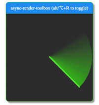

To provide a smooth user experience the browser needs to be able to render 60 frames per second, which means rendering a frame every 16ms. If you have long-running javascript tasks than you're going to start dropping frames, and that will be obvious if the user is scrolling or a animation is being rendered. 

There are some tecniques to avoid janking the UI, with the most common one being to move such tasks to a Web Worker. In this post I'm going to investigate a different approach: How to split work into chunks and use the CPU's idle periods process them. This technique is used by the React's team in the reconcile mechanism: the reconciliation of a tree can be interruped to give way to a more priority work, improving the user's [perceived performance](https://blog.teamtreehouse.com/perceived-performance).

Note: everything in this post is heavily inspired on react's fiber architecture, and if you jump to the resources section you'll get some resources that can help you figuring out how react works.


# Test case
Not all javascript long-running tasks are easy to split into different chunks, so I'll create a example that is related with my current area of work: spreadsheets (checkout about [dashdash](//dashdash.com)).

Given a spreadsheet in which A1=99 and each row from A2 to A100000 adds 10 the previous row. A2's formula will output a value of 109, A3 => 119, etc. A100000 => 99 + (10 * 99 999) = 1 000 089. Changing the value of A1 will have a ripple effect and 99 999 calcs will have to be done, **sequentially**. 

In this contrived example we'll not care about a proper traversal algorithm, circular dependencies detection, multiple cell dependencies etc. These are super complex problems on their own and would make it harder to keep focus on how to split work and execute it in CPU's idle periods.

Lets keep this structure as simple as possible, given a cell with the following structure:

```js
interface ICell {
  id: string;
  formula: string | null;
  value: number | null;
  dependantCellId: string;
}
```

Create a Cell map indexed by cell id:

```js
const cells = new Map<ICell>();
cells.set('A1', { 
  id: 'A1', 
  dependantCellId: 'A2', 
  formula: null, 
  value: 99 
});
cells.set('A2', { 
  id: 'A2', 
  dependantCellId: 'A3', 
  formula: '=A1+10', 
  value: null 
});

...

cells.set('A1000000', { 
  id: 'A1000000', 
  dependantCellId: null, 
  formula: '=A99999+10', 
  value: null 
});
```

Our datastrucutre is a simple map of cells. Each cell has a id, a formula, a value and a dependantCellId (cell that depends on the value of the current cell). When a cell is changed we need to update its value, travel to his dependant cell, update it and keep doing this until we reach our leaf cell (cell without dependant).

# Requirements
Our solution should support the following requirements:

* No dropped frames, the page should be responsive at all times
* Processing should be interruptable (either because new data was introduced or user wants to leave the page)
* UI should be updated only when full computation is complete (we don't want stale data to be presented)
* Should be as fast as possible given the previous constraints (if we split execution in chunks it will take a bit longer to process but the page will be responsive, and therefore the perceived perfomance will appear to be better)
* Relatively easy to maintain and to reason with

# How to measure the quality of our approach?
* Create a simple example;
* Use [async-render-toolbox](https://github.com/sw-yx/async-render-toolbox) chrome extensions to have a visual cue of the CPU lag;
* Create a counter and a timer to make sure page is still interactive while processing a queue;
* Use devtools for some extra performance inspection;

# Use CPU's idle periods

> The [window.requestIdleCallback()](https://developer.mozilla.org/en-US/docs/Web/API/Window/requestIdleCallback) method queues a function to be called during a browser's idle periods. This enables developers to perform background and low priority work on the main event loop, without impacting latency-critical events such as animation and input response. Functions are generally called in first-in-first-out order; however, callbacks which have a timeout specified may be called out-of-order if necessary in order to run them before the timeout elapses.

By calling requestIdleCallback we schedule a callback for the next CPU idle period. In that callback we can check how long we got left before the idle period ends by calling `deadline.timeRemaining()`. The maximium amount of idle time is 50ms, but most of the times we'll get less time than that depending on how busy the CPU is. Using the timeRemaining and a constant max time for each calculation we can check if we have free time to do one more calc or reschedule to the next idle period. We'll schedule a new callback until there are no more tasks to execute. By processing our cells this way, we make sure to not interrupt latency-critical events and provide a smooth user experience. 

# Lets code!
Looking at our problem one would be tempted to use recursion. But that would break some of our requirements. How would you pause a recursive walk of our tree? How would you resume it? That is why we should follow a approach based on a linked list traversal.

First we need to define the datastructure for our unit of work:

```js
interface IUnitOfWork {
  triggerCellId: string;
  cell: ICell
}
```

First we need to create a dummy function that will represent our cell computation, lets call it `performUnitOfWork`. This function should receive a unit of work, with a cell to be calculated. After completing the work should return a new unit of work pointing to the next cell to be executed.

```js
function performUnitOfWork(nextUnitOfWork: IUnitOfWork): IUnitOfWork {
    const { cell, triggerCellId } = nextUnitOfWork;

    if (cell.formula) {
        // hardcoded formula matcher
        const [parentId, addingValue] = formula.match(/(\w\d+)\+(\d+)/);
        const previousValue = spreadsheet.data[parentId].value;
        const newValue = previousValue + addingValue;
        spreadsheet.data[cell.id].value = newValue;
    }

    if (!cell.dependants.length) return null;

    /** 
     * Keeping the triggerCellId will allow us to know at all times 
     * which cell triggered the current computation
     */
    return {
      triggerCellId, 
      cell: spreadsheet.data[cell.dependant] 
    };
}
```

This function extracts the id of the cell in the formula, adds 10 to the value of the referred cell, updates the current cell value and returns the next cell.

The following snippet shows how we would process our test data with a regular `while` loop:

```js
function updateDependantsValue = (cell: ICell): void => {
  let nextUnitOfWork = { triggerCellId: cell.id, cell };
  while (nextUnitOfWork) {
      nextUnitOfWork = performUnitOfWork(nextUnitOfWork);
  }
};
```

To process the same data with a `requestIdleCallback` scheduler, the code would be a bit more complex:

```js
/**
 * How long we think that we need to have to be able 
 * to process a single unit of work
 * We might need to tweak this.
 */
const ENOUGH_TIME = 1; // in ms
let workQueue: ICell[] = [];
let nextUnitOfWork: IUnitOfWork | null = null;

function resetNextUnitOfWork() {
  const cell = workQueue.shift();
  if (!cell) return;

  nextUnitOfWork = { triggerCellId: cell.id, cell };
}

function workLoop(deadline: number): void {
  if (!nextUnitOfWork) {
    resetNextUnitOfWork();
  }

  while (nextUnitOfWork && deadline.timeRemaining() > ENOUGH_TIME) {
    nextUnitOfWork = performUnitOfWork(nextUnitOfWork);
  }
}

function performWork(deadline: number): void {
  workLoop(deadline);

  if (nextUnitOfWork || workQueue.length > 0) {
      requestIdleCallback(performWork);
  }
}

function updateDependantsValue(cell: ICell): void {
  /** 
   * Verify if there is already a work being 
   * process that was triggered by the same cell
   */
  const isInProgress = 
    nextUnitOfWork && 
    nextUnitOfWork.triggerCellId === cell.id;

  if (isInProgress) {
    nextUnitOfWork = null;
  }
  workQueue.push(cell);

  requestIdleCallback(performWork);
}
```

To start processing our test data we call scheduleWork with a cell. A cell represents a cell that has been changed and requires our computation module to perform calculations.

First we need to check if there is a work in progress that was triggered by the same cell that we were passed, if so that should be interrupted and added back to the end of the workQueue. After updating the queue, a performWork callback is scheduled with the **requestIdleCallback**.

When we get a slot of idle cpu time, the function **performWork** is called. This function calls the **workLoop** which is responsible to get the next cell in the workQueue and then do a while loop calling **performUnitOfWork** while it still has time left in the idle period. 

The **performUnitOfWork** computes the cell value and returns the next cell to be computed which gets assigned to the **nextUnitOfWork**. 

Once there is no more time to process cells, the performWork function will schedule a **requestIdleCallback** to pickup the work on the next cpu idle time.

This loop will keep going on until there are no more nextUnitOfWork or items in the workQueue.

# Results
The blocking iteration approach is much faster to execute, but, as visible in **fig. 1** it has a lot of drop frames. The page would be unresponsive for a second there. The idle callback approach takes longer to execute, its time of execution is not predictable as it depends on how busy the CPU is, but the page is responsive at all times (**fig. 2**) and therefore the perceived performance might be much better.

<div class="gallery">
  <div class="gallery__item">
    
    <label><strong>fig. 1:</strong> with while loop</label>
  </div>
  <div class="gallery__item">
    
    <label><strong>fig. 2:</strong> with idle callback</label>
  </div>
</div>

# Conclusion
In this isolated test it seems that the approach with **requestIdleCallback** checks our requirements.

If we're processing 100 calcs, the time to execution with idle does not vary much from the regular blocking operation, but if we're processing 100 000, the idle approach will take longer, but smoother. Its a tradeoff, that personally, I think its worth it. 

There is though, a caveat, the [browser support](https://caniuse.com/#search=requestIdle) is not yet ideal... Its not yet supported by neither IE Edge or safari... Always those two, right? :disappointed: There are ways to shim it, such as this simple [gist](https://gist.github.com/paullewis/55efe5d6f05434a96c36) and [react's approach](https://github.com/facebook/react/blob/master/packages/scheduler/src/Scheduler.js#L415), which is a more complex and robust.

But, there are a few topics that will require further exploration:
* How well does this work integrated with react's scheduler?
* According to [@sebmarkbage](https://twitter.com/sebmarkbage/status/822881464794497024) most requestIdleCallback shims are not a accurate representation of what requestIdleCallback should do. Can we find a good shim or even use the one that react uses?

# Resources
* [Github repo with code presented in this article](https://github.com/canastro/heavy-fe-computation)
* [Udacity's "Browser Rendering Optimization" course by Google](https://www.udacity.com/course/browser-rendering-optimization--ud860)
* [Perceived Performance](https://blog.teamtreehouse.com/perceived-performance)
* [Fiber Principles: Contributing To Fiber](https://github.com/facebook/react/issues/7942)
* [The how and why on React’s usage of linked list in Fiber to walk the component’s tree](https://medium.com/react-in-depth/the-how-and-why-on-reacts-usage-of-linked-list-in-fiber-67f1014d0eb7)

*<strong>Disclaimer:</strong> Opinions are my own and not the views of my employer.*

*If you find any error, be it on my poor english or any technical detail, please don't be shy. I'll try to continuously improve this blog post :simple_smile:*