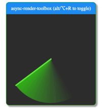

To provide a smooth user experience the browser needs to be able to render 60 frames per second, which means rendering a frame every 16ms. If you have long-running javascript tasks than you're going to start dropping frames, and that will be obvious if the user is scrolling or a animation is being rendered.

There are some techniques to avoid janking the UI, with the most common one being to move such tasks to a Web Worker. In this post I'm going to investigate a different approach: How to split work into chunks and use the CPU's idle periods process them. This technique is used by the React's team in their fiber architecture: the reconciliation of a tree can be interrupted to give way to a more priority work, improving the user's [perceived performance](https://blog.teamtreehouse.com/perceived-performance).

Note: everything in this post is heavily inspired on react's fiber architecture (but in a very simplified approach). If you jump to the resources section you'll get some resources that can help you figuring out how react works.

## Test case

A list of 100 000 nodes where the value of a node is computed based on the value of the previous node - when the user changes the first node every node in that chain will have to be recomputed, producing 99 999 nodes performing blocking computation.

Having a Node the following interface:

```js
interface INode {
    id: string;
    value: number | null;
    previousId: string | null;
    nextId: string | null;
}
```

Create a Map of nodes:

```js
const nodes = new Map<INode>();
nodes.set('A1', {
  id: 'A1',
  nextId: 'A2',
  previousId: null,
  value: 99
});
nodes.set('A2', {
  id: 'A2',
  nextId: 'A3',
  previousId: 'A1',
  value: null
});

...

nodes.set('A100000', {
  id: 'A100000',
  nextId: null,
  previousId: 'A99999',
  value: null
});
```

## Requirements

Our solution should support the following requirements:

-   No dropped frames, the page should be responsive at all times
-   Processing should be interruptable (either because new data was introduced or user wants to leave the page)
-   Should be as fast as possible given the previous constraints (if we split execution in chunks it will take a bit longer to process but the page will be responsive, and therefore the perceived performance will appear to be better)

## How to measure the quality of our approach?

-   Create a simple app - I'll be using a app with Create React App;
-   Add a scrollable area, and some animations to be able to test user interaction;
-   Use [async-render-toolbox](https://github.com/sw-yx/async-render-toolbox) chrome extensions to have a visual cue of the CPU lag;
-   Use devtools for some extra performance inspection;

Yes, its not very scientific... But what we really want to improve here is the perceived performance, and thats more a sensorial experience.

## Use CPU's idle periods

> The [window.requestIdleCallback()](https://developer.mozilla.org/en-US/docs/Web/API/Window/requestIdleCallback) method queues a function to be called during a browser's idle periods. This enables developers to perform background and low priority work on the main event loop, without impacting latency-critical events such as animation and input response. Functions are generally called in first-in-first-out order; however, callbacks which have a timeout specified may be called out-of-order if necessary in order to run them before the timeout elapses.

By calling requestIdleCallback we schedule a callback for the next CPU idle period. In that callback we can check how long we got left before the idle period ends by calling `deadline.timeRemaining()`. The maximium amount of idle time is 50ms, but most of the times we'll get less time than that depending on how busy the CPU is.

Using the timeRemaining and a constant max time for each calculation we can check if we have free time to do one more calc or reschedule to the next idle period. We'll schedule a new callback until there are no more tasks to execute. By processing our nodes this way, we make sure to not interrupt latency-critical events and provide a smooth user experience.

## Schedule work

Since we're using CPU's idle time, the user can at anytime interact with the page and schedule a new piece of work. This means that we should keep a queue of pending work.

If a given node is being processed and a new work is scheduled for that same node, we should abort the current work and push that node to the end of the queue again:

```js
interface IUnitOfWork {
    triggerNodeId: string;
    node: INode;
}

let workQueue: INode[] = [];
let nextUnitOfWork: IUnitOfWork | null = null;

function scheduleWork(node: INode): void {
    /**
     * Verify if there is already a work being
     * process that was triggered by the same node
     */
    const isInProgress = nextUnitOfWork && nextUnitOfWork.triggerNodeId === node.id;

    if (isInProgress) {
        nextUnitOfWork = null;
    }
    workQueue.push(node);

    requestIdleCallback(performWork);
}
```

We're basing our approach on the CPU's available time, but how do we know that the time available is enough to do a unit of work? Well, thats a though cookie! The way this problem is currently attacked is by assuming a median time we usually take to process each unit of work and store it in a constant `ENOUGH_TIME`. This will require tweaking and it will be pretty specific to the work you'll have to do in your app.

```js
const ENOUGH_TIME = 2; // in ms
```

As we seen in the previous snippet when we schedule work we make a call to `requestIdleCallback` which will eventually call our `performWork` function. In this function we kickoff the `workLoop`.

The `workLoop` gets the next unit of work, if theres none it picks up a new node from the workQueue. And starts calling our `performUnitOfWork` function in a while loop until we reach a point where we think theres no more time left or there are no more units of work. The `performUnitOfWork` is your function that processes each node (not getting into details about this function here as is mostly dummy computations in this case).

Once the `workLoop` finishes we get back to the `performLoop` function and if there is still a nextUnitOfWork or a node in the workQueue, then we schedule a new idle callback and start the process all over.

```js
function resetNextUnitOfWork() {
    const node = workQueue.shift();
    if (!node) return;

    nextUnitOfWork = { triggerNodeId: node.id, node };
}

function workLoop(deadline: number): void {
    if (!nextUnitOfWork) {
        resetNextUnitOfWork();
    }

    while (nextUnitOfWork && deadline.timeRemaining() > ENOUGH_TIME) {
        nextUnitOfWork = performUnitOfWork(nextUnitOfWork);
    }
}

function performWork(deadline: number): void {
    workLoop(deadline);

    if (nextUnitOfWork || workQueue.length > 0) {
        requestIdleCallback(performWork);
    }
}
```

## Results

The blocking iteration approach is much faster to execute, but, as visible in **fig. 1** it has a lot of drop frames. The page would be unresponsive for a second there. The idle callback approach takes longer to execute, its time of execution is not predictable as it depends on how busy the CPU is, but the page is responsive at all times (**fig. 2**) and therefore the perceived performance might be much better.

<div style="display: flex;align-items: center;justify-content: center;flex-wrap: wrap;margin-bottom: 1.75rem;">
  <div style="display: flex;flex-direction: column;
align-items: center;justify-content: center;">
    
    <label style="font-size: 0.75rem;"><strong>fig. 1:</strong> with while loop</label>
  </div>
  <div style="display: flex;flex-direction: column;
align-items: center;justify-content: center;">
    
    <label style="font-size: 0.75rem;"><strong>fig. 2:</strong> with idle callback</label>
  </div>
</div>

Check [this video](https://github.com/canastro/blog-offload-computation/raw/master/idle-vs-normal.mp4) to see the result of the output of the sample created while writing this article.

## Conclusion

In this isolated test it seems that the approach with **requestIdleCallback** checks our requirements.

If we're processing 100 calcs, the time to execution with idle does not vary much from the regular blocking operation, but if we're processing 100 000, the idle approach will take longer, but smoother. Its a tradeoff, that personally, I think its worth it.

There is though, a caveat, the [browser support](https://caniuse.com/#search=requestIdle) is not yet ideal... Its not yet supported by neither IE Edge or safari... Always those two, right? :disappointed: There are ways to shim it, such as this simple [gist](https://gist.github.com/paullewis/55efe5d6f05434a96c36) and [react's approach](https://github.com/facebook/react/blob/master/packages/scheduler/src/Scheduler.js#L415), which is a more complex and robust.

But, there are a few topics that will require further exploration:

-   How well does this work integrated with react's scheduler?
-   According to [@sebmarkbage](https://twitter.com/sebmarkbage/status/822881464794497024) most requestIdleCallback shims are not a accurate representation of what requestIdleCallback should do. Can we find a good shim or even use the one that react uses?
-   How does this compare with using webworkers (or other possible approaches)? - I hope to be able to answer this in future articles.

## Resources

-   [Github repo with code presented in this article](https://github.com/canastro/blog-offload-computation)
-   [Udacity's "Browser Rendering Optimization" course by Google](https://www.udacity.com/course/browser-rendering-optimization--ud860)
-   [Perceived Performance](https://blog.teamtreehouse.com/perceived-performance)
-   [Fiber Principles: Contributing To Fiber](https://github.com/facebook/react/issues/7942)
-   [The how and why on React’s usage of linked list in Fiber to walk the component’s tree](https://medium.com/react-in-depth/the-how-and-why-on-reacts-usage-of-linked-list-in-fiber-67f1014d0eb7)
-   [Using requestIdleCallback](https://developers.google.com/web/updates/2015/08/using-requestidlecallback)

_<strong>Disclaimer:</strong> Opinions are my own and not the views of my employer._

*If you find any error, be it on my poor english or any technical detail, please don't be shy and tweet me about it. I'll try to continuously improve this blog post* :simple_smile:
