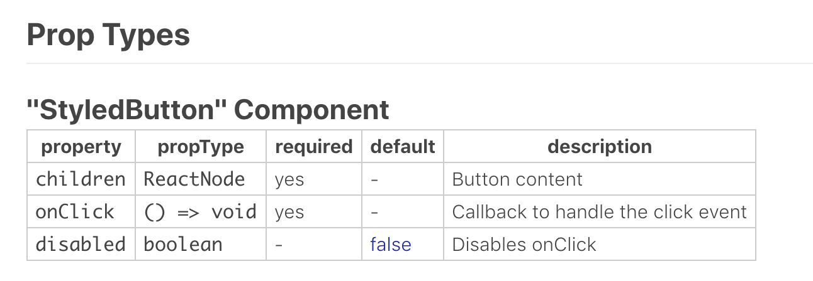

This is a series of posts about how to create a module of reusable ui components with typescript, storybook and styled components:
* Part 1 - React UI-Kit - Setup, Create first component and Sample app
* Part 2 - React UI-Kit - Adding a theme

It's pretty common to repeat yourself and recreate the same basic ui components multiple times when starting new projects. In this post I'll try to guide you in creating a reusable module for your UI components.

This project should be self-documented through tsdocs, have a great way for developers (and designers or product owners) to see the available components, all their different options / behaviours and how to use it.

The tools we're going to use are: **React**, **Typescript**, **Storybook** and **Styled-components**.

# Kickoff and setup

Create a folder for your ui-kit, lets call it, **bob-ross-kit**. Do the `npm init` thing and add the following dependencies:

```json
  "devDependencies": {
    "@storybook/addon-info": "^4.1.4",
    "@storybook/addon-knobs": "^4.1.4",
    "@storybook/addons": "^4.1.4",
    "@storybook/react": "^4.1.4",
    "@types/react": "^16.7.17",
    "@types/react-dom": "^16.0.11",
    "@types/styled-components": "^4.1.4",
    "babel-core": "^6.26.3",
    "babel-plugin-styled-components": "^1.10.0",
    "react-docgen-typescript-loader": "^3.0.0",
    "ts-loader": "^5.3.2",
    "typescript": "^3.2.2"
  },
  "dependencies": {
    "react": "^16.6.3",
    "react-dom": "^16.6.3",
    "styled-components": "^4.1.3"
  }
```

WOW, thats a lot of dependencies for a empty project :D Do not worry, we're going to use them all!


## Storybook

> Storybook is a UI development environment and playground for UI components. The tool enables users to create components independently and showcase components interactively in an isolated development environment.

We're going to add [storybook](https://storybook.js.org/) and a few addons to add extra features to our stories. If you want a more detailed and beginner friendly intro to storybook, check out [Storybook for React - Getting Started](https://storybook.js.org/basics/guide-react/).

> By default, Storybook comes with a way to list stories and visualize them. Addons implement extra features for Storybooks to make them more useful.


**[@storybook/addon-info](https://www.npmjs.com/package/@storybook/addon-info):** 
show additional information about your stories, properly configured it can show docs of your props and the jsx of the usage of your component

**[@storybook/addon-knobs](https://www.npmjs.com/package/@storybook/addon-knobs):**
adds a section on the bottom where you can add props modifiers to see how a component reacts to different props;


In order to configure storybook, start by creating a **.storybook** folder with **addons.js** and **config.js** files.

1. Create a **addons.js** file to import our addons that need a register step:

```js
import '@storybook/addon-knobs/register';
```


2. Create a **config.js** file. Here we configure our addons and tell storybook how to load your stories. Personally I prefer to have the stories as a file next to the component, prefixed with **.stories.js**.

```js
import { addDecorator, configure, setAddon } from '@storybook/react';
import { withInfo } from '@storybook/addon-info';
import { withKnobs } from '@storybook/addon-knobs/react';

addDecorator(withInfo({ header: true, inline: true }));
addDecorator(withKnobs);

const req = require.context('../src', true, /.stories.jsx$/);

function loadStories() {
  req.keys().forEach(file => req(file));
}

configure(loadStories, module);
```


3. Add a storybook script to your package.json.

```json
"scripts": {
    "storybook": "start-storybook -p 6006 -c .storybook"
}
```

## Typescript

> TypeScript is an open-source programming language developed and maintained by Microsoft. It is a strict syntactical superset of JavaScript, and adds optional static typing to the language.

Besides the obvious of adding static typing to our code, using [typescript](https://www.typescriptlang.org/) is also great for IDE integration. For a reusable module is really great to have a awesome autocomplete, this will allow developers to use your components without having to jump to the documentation every time.


1. Init the typescript setup with `npx tsc --init` this should create a default **tsconfig** file and make some changes to it:

```json
"outDir": "build/lib",
"lib": ["es5", "es6", "es7", "es2017", "dom"],
"sourceMap": true,
"allowJs": false
"jsx": "react",
"moduleResolution": "node",
"rootDir": "src",
"baseUrl": "src",
"experimentalDecorators": true,
"declaration": true
```

2. In order to use storybook with typescript we need to create a **.storybook/webpack.config.js** file:

```js
const path = require('path');

module.exports = (baseConfig, env, config) => {
  config.module.rules.push({
    test: /\.tsx?$/,
    include: path.resolve(__dirname, '../src'),
    use: [require.resolve('ts-loader'), require.resolve('react-docgen-typescript-loader')]
  });

  config.resolve.extensions.push('.ts', '.tsx');

  return config;
};

```

You might notice the `TSDocgenPlugin` plugin. This will pick your tsdocs from your typings and together with `@storybook/addon-info` will endow your stories with info from your props. 

This:
```js
export interface Props {
  /** Button content  */
  children: React.ReactNode;
  /** Callback to handle the click event  */
  onClick: () => void;
  /**
   * Disables onClick
   *
   * @default false
   **/
  disabled?: boolean;
}
```

Will be rendered as a table in our story, like this: 


3. Add a build and watch script to your package.json:

```json
"scripts": {
    ...
    "build": "tsc",
    "build:watch": "tsc --watch"
},
```

This is not exactly required, you can call directly tsc, but personally I prefer to have all scripts with npm aliases.

## Styled Components
> Utilising tagged template literals (a recent addition to JavaScript) and the power of CSS, styled-components allows you to write actual CSS code to style your components. It also removes the mapping between components and styles – using components as a low-level styling construct could not be easier!

1. Create a .babelrc file in the root of your project with: 
```json
{ "plugins": ["babel-plugin-styled-components"] }
```

And thats it. The project is finally configured... 

# Create your first component

Lets create a simple button, in a file called **src/styled-button/styled-button.tsx**:

```js
import * as React from 'react';
import styled from 'styled-components';

export interface Props {
  /** Button content  */
  children: React.ReactNode;
  /** Callback to handle the click event  */
  onClick: () => void;
  /**
   * Disables onClick
   *
   * @default false
   **/
  disabled?: boolean;
}

const noop = () => {};

const RootStyledButton = styled.button`
  padding: 0px 20px;
  height: 49px;
  border-radius: 2px;
  border: 2px solid #3d5567;
  display: inline-flex;
  background-color: ${() => (props.disabled ? 'red' : 'blue')};
`;

const ButtonSpan = styled.span`
  margin: auto;
  font-size: 16px;
  font-weight: bold;
  text-align: center;
  color: #fff;
  text-transform: uppercase;
`;

export const StyledButton: React.SFC<Props> = (props: Props): React.ReactNode => {
  const { children, onClick, disabled = false } = props;

  return (
    <RootStyledButton disabled={disabled} onClick={!disabled ? onClick : noop}>
      <ButtonSpan>{children}</ButtonSpan>
    </RootStyledButton>
  );
};
```

# Create your first story

As mentioned before, we conventioned to have our stories next to our components with the prefix **.stories.jsx**. So lets create a file called 
**styled-button.stories.jsx** next to our component with the following content:

```js
import React from 'react';
import { text, boolean } from '@storybook/addon-knobs/react';
import { storiesOf } from '@storybook/react';

import { StyledButton } from './styled-button';

storiesOf('StyledButton', module)
  .add('basic', () => (
    <StyledButton disabled={boolean('disabled', false)}>
      {text('text', 'Hello World')}
    </StyledButton>
  ));
```

As you can see we use some helper functions from `@storybook/addon-knobs`. These functions receive a name and a default value to pass to the component, while at the same time gathers info to display inputs to dynamically allow the user to change the values on the UI.

You can now run `npm run storybook`, open `http://localhost:6006/` and voilá.


# Prepare your project to be used by others
1. Create a **index.ts** exporting the files you want to expose: 

```js
export { default as StyledButton } from './styled-button/styled-button';
```

2. Do `npm link` on your bob-ross-kit project so that you can use it while developing without having to actually publish to npm.

3. Update **package.json** with your main entry file: `"main": "build/lib/index.js",`

# Consume our lib

1. Create a project with `create-react-app`

2. Do `npm link bob-ross-kit` to install our lib for development

3. Now use your components within the provider, and they'll have access to the theme props:

```js
import React from 'react';
import { StyledButton } from 'bob-ross-kit';

const Comp = () => (
    ...
    <StyledButton onClick={() => console.log('clicked')}>Button</StyledButton>
    <StyledButtton disabled>My Button</StyledButton>
    ...
)
```

# Publishing
So far we used ` npm link `, but this will only work while using locally. Next step would be publishing your module into npm, check how to [Creating and publishing unscoped public packages](https://docs.npmjs.com/creating-and-publishing-unscoped-public-packages) or [Creating and publishing scoped public packages](https://docs.npmjs.com/creating-and-publishing-scoped-public-packages).

After publishing you just need to install your module as you would install any other npm dependency.


# Conclusion

I hope that by the end of this articled I helped you to:
* Configure typescript
* Configure storybook with some good addons and integration with typescript
* Create basic styled-components
* Understand how a app can consume our UI kit

So we got the fundamentals to build a reusable ui kit. But we can still improve it, and we will, in part 2.

Check the source code on of **bob-ross-kit** on [github](https://github.com/canastro/bob-ross-kit/tree/blog-stuff)

# Credits
This post is heavily based on Shawn Wang egghead's course ["Design Systems with React and Typescript in Storybook"](https://egghead.io/courses/design-systems-with-react-and-typescript-in-storybook). I did some tweaks and started adding some features on top of whats accomplished by the end of that course.