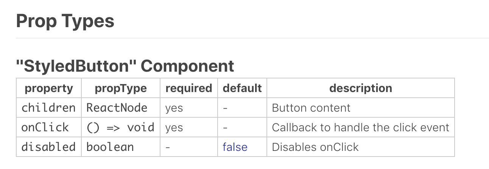

It's pretty common to repeat yourself and recreate the same basic ui components multiple times when starting new projects. In this post I'll try  to guide you in creating a reusable module for your UI components.

This project should be self-documented through tsdocs, have a great way for developers (and designers or product owners) to see the available components, all their different options / behaviours and how to use it.

# Kickoff and setup

Create a folder for your ui-kit, lets call it, `bob-ross-kit`. Do the npm init thing and add the following dependencies:

```json
  "devDependencies": {
    "@storybook/addon-info": "^4.1.4",
    "@storybook/addon-knobs": "^4.1.4",
    "@storybook/addons": "^4.1.4",
    "@storybook/react": "^4.1.4",
    "@types/react": "^16.7.17",
    "@types/react-dom": "^16.0.11",
    "@types/styled-components": "^4.1.4",
    "awesome-typescript-loader": "^5.2.1",
    "babel-core": "^6.26.3",
    "babel-plugin-styled-components": "^1.10.0",
    "react-docgen-typescript-webpack-plugin": "^1.1.0",
    "typescript": "^3.2.2"
  },
  "dependencies": {
    "react": "^16.6.3",
    "react-dom": "^16.6.3",
    "styled-components": "^4.1.3"
  }
```

WOW, thats a lot of dependencies for a empty project :D Do not worry, we're going to use them all!


## Storybook

> Storybook is a UI development environment and playground for UI components. The tool enables users to create components independently and showcase components interactively in an isolated development environment.

We're going to add [storybook](https://storybook.js.org/) into your project a a few addons to add extra features to our stories.

**[@storybook/addon-info](https://www.npmjs.com/package/@storybook/addon-info):** 
show additional information about your stories, properly configured it can show jsdocs of your props and the jsx of the usage of your component

**[@storybook/addon-knobs](https://www.npmjs.com/package/@storybook/addon-knobs):**
adds a section on the bottom where you can add props modifiers to see how a component reacts to different props;


In order to configure storybook, start by creating a `.storybook` folder with `addons.js` and `config.js` files.

1. Create a `addons.js` file to import our addons
```js
import '@storybook/addon-knobs/register';
```


2. Create a `config.js` file. Here we configure our addons and tell storybook how to load your stories. Personally I prefer to have the stories as a file next to the component, prefixed with `.stories.js`.

```js
import { addDecorator, configure, setAddon } from '@storybook/react';
import { withInfo } from '@storybook/addon-info';
import { withKnobs } from '@storybook/addon-knobs/react';

addDecorator(withInfo({ header: true, inline: true }));
addDecorator(withKnobs);

const req = require.context('../src', true, /.stories.js$/);

function loadStories() {
  req.keys().forEach(file => req(file));
}

configure(loadStories, module);
```


3. Add a storybook script to your package.json: 

```json
"scripts": {
    "storybook": "start-storybook -p 6006 -c .storybook"
}
```

## Typescript

> TypeScript is an open-source programming language developed and maintained by Microsoft. It is a strict syntactical superset of JavaScript, and adds optional static typing to the language.

Besides the obvious of adding static typing to our code, using [typescript](https://www.typescriptlang.org/) is also great for IDE integration. For a reusable module is really great to have a awesome autocomplete, this will allow developers to use your components without having to jump to the documentation every time.


1. Init the typescript setup with `npx tsc --init` this should create a default `tsconfig` file and make some changes to it:

```json
"outDir": "build/lib",
"lib": ["es5", "es6", "es7", "es2017", "dom"],
"sourceMap": true,
"allowJs": false
"jsx": "react",
"moduleResolution": "node",
"rootDir": "src",
"baseUrl": "src",
"experimentalDecorators": true,
"declaration": true
```

2. In order to use storybook with typescript we need to create a `.storybook/webpack.config.js` file:

```js
const path = require('path');
const TSDocgenPlugin = require('react-docgen-typescript-webpack-plugin');
module.exports = (baseConfig, env, defaultConfig) => {
  // webpack typescript loader
  defaultConfig.module.rules.push({
    test: /\.(ts|tsx)$/,
    loader: require.resolve('awesome-typescript-loader'),
  });

  // Doc gen plugin
  defaultConfig.plugins.push(new TSDocgenPlugin());
  defaultConfig.resolve.extensions.push('.ts', '.tsx');
  return defaultConfig;
};
```

You might notice the `TSDocgenPlugin` plugin. This will pick your tsdocs from your typings and together with `@storybook/addon-info` will endow your stories with info from your props. 

This:
```js
export interface Props {
  /** Button content  */
  children: React.ReactNode;
  /** Callback to handle the click event  */
  onClick: () => void;
  /**
   * Disables onClick
   *
   * @default false
   **/
  disabled?: boolean;
}
```

Becomes: 


3. Add a build script to your package.json:

```json
"scripts": {
    ...
    "build": "tsc"
},
```

This is not exactly required, you can call directly tsc, but personally I prefer to have all scripts with npm aliases.

## Styled Components
> Utilising tagged template literals (a recent addition to JavaScript) and the power of CSS, styled-components allows you to write actual CSS code to style your components. It also removes the mapping between components and styles – using components as a low-level styling construct could not be easier!

1. Create a .babelrc file in the root of your project with: `{ "plugins": ["babel-plugin-styled-components"] }`

And thats it. The project is finally configured... 

# Create your first component

Lets create a simple button, in a file called `src/styled-button/styled-button.jsx`:

```js
import * as React from 'react';
import styled from 'styled-components';

export interface Props {
  /** Button content  */
  children: React.ReactNode;
  /** Callback to handle the click event  */
  onClick: () => void;
  /**
   * Disables onClick
   *
   * @default false
   **/
  disabled?: boolean;
}

const noop = () => {};

const RootStyledButton = styled.button`
  padding: 0px 20px;
  height: 49px;
  border-radius: 2px;
  border: 2px solid #3d5567;
  display: inline-flex;
  background-color: ${() => (props.disabled ? 'red' : 'blue')};
`;

const ButtonSpan = styled.span`
  margin: auto;
  font-size: 16px;
  font-weight: bold;
  text-align: center;
  color: #fff;
  text-transform: uppercase;
`;

export const StyledButton = (props: Props) => {
  const { children, onClick, disabled = false } = props;

  return (
    <RootStyledButton disabled={disabled} onClick={!disabled ? onClick : noop}>
      <ButtonSpan>{children}</ButtonSpan>
    </RootStyledButton>
  );
};
```

# Create your first story

As mentioned before, we conventioned to have our stories next to our components with the prefix `.stories.jsx`. So lets create a file called 
`styled-button.stories.jsx` next to our component with the following content:

```js
import React from 'react';
import { text, boolean } from '@storybook/addon-knobs/react';
import { storiesOf } from '@storybook/react';

import { StyledButton } from './styled-button';

storiesOf('StyledButton', module)
  .add('basic', () => (
    <StyledButton disabled={boolean('disabled', false)}>
      {text('text', 'Hello World')}
    </StyledButton>
  ));
```

As you can see we use some helper functions from `@storybook/addon-knobs`. These functions receive a name and a default value to pass to the component, while at the same time gathers info to display inputs to dynamically allow the user to change the values on the UI.

You can now run `npm run storybook`, open `http://localhost:6006/` and voilá.

# Create a theme

Probably your components will have some common UI characteristics, such as colors, paddings, fonts, etc. So having a theme to normalize this will come handy. 

In this tutorial we're just going to create a palette for the theme, but lets create it in a separate file to promote some separation instead of creating a huge file with all theme variables.

`src/theme/palette.ts`:
```js
const palette = {
  white: '#fff',
  grey: '#f7f9fa',
  black: '#222',
  primary: '#6d30e7',
  secondary: '#dfdded'
};

export default palette;
```

`src/theme/index.ts`:

```js
import palette from './palette';

export default {
    palette
};
```

In order to use this theme we're going to use the styled-components [ThemeProvider](https://www.styled-components.com/docs/advanced#theming), the usage would be something like this:

```js 
const MyPage = () => (
  <ThemeProvider theme={theme}>
    <StyledButton>Hello World!</StyledButton>
  </ThemeProvider>
);
```

But, has you might notice, the StyleButton does not do anything with the provided theme, so we need to change something. If you go back to your `styled-button.jsx` you can change your RootStyledButton to use theme colors instead of hardcoded colors for example. To access the theme you add a function to your template literal and get the theme from the props:

```js
const RootStyledButton = styled.button`
  padding: 0px 20px;
  height: 49px;
  border-radius: 2px;
  border: 2px solid ${props => props.theme.secondary};
  display: inline-flex;
  background-color: ${props => (props.disabled ? props.theme.secondary : props.theme.primary)};
`;
```

So, now we need to update our story to also include the theme. Storybook has a function called `addDecorator` which allows you to define a high order component that will be use with all your stories, so just make sure you import the ThemeProvider and the theme and add your decorator to your story:

```js
.addDecorator(renderStory => <ThemeProvider theme={theme}>{renderStory()}</ThemeProvider>)
```

# Publishing and Usage